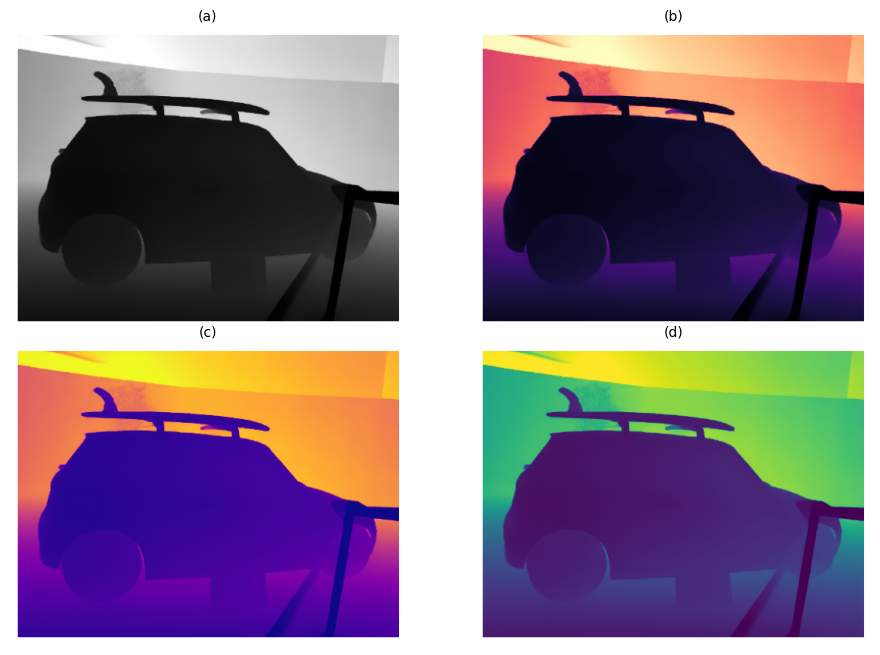

# Datasets 
Our experiments are conducted using depth images from three sources: the **ImageNet validation set**, a **200-class subset of it**, and the **Washington RGB-D Object Dataset**.  Due to computational constraints, we focus exclusively on the validation portions of each dataset. The main focus is exclusively on depth images, either obtained via estimation or captured directly using depth sensors. Below, we describe each dataset, its source, and the preprocessing steps applied.

### ImageNet 1k-class depth
ImageNet is a large-scale dataset originally developed for visual object recognition, containing over 1.4 million images across 1,000 classes. Due to its size, we limited our experiments to the 50,000-image validation set. Since ImageNet contains only RGB images, we used **Marigold**—a diffusion-based model for depth estimation—to generate corresponding depth maps.

The resulting depth images are **single-channel**, **16-bit PNGs**, with each pixel encoding depth information. These synthesized depth maps enable us to evaluate the feasibility of using depth-only inputs for image classification with standard architectures.

### ImageNet 200-class depth 
To further reduce computational overhead while maintaining diversity in object categories, we construct a **200-class subset of ImageNet** by randomly sampling 200 classes from the full 1,000-class set. This subset contains 10,000 images, with 50 images per class. The list of sampled classes can be found [here](https://gitlab.com/dariofurlan/vcs-2425/-/blob/main/packages/core/imagenet-val-200/imagenet_200_class_list.txt). The depth maps for these images are also generated using Marigold. This smaller subset allows us to conduct more detailed evaluations by reducing label space complexity while also preserving the large-scale nature of ImageNet.

### Washington-RGB-D
The Washington RGB-D Object Dataset is a real-world RGB-D dataset widely used in robotics and object recognition research. It was captured by a **Microsoft Kinect sensor** and contains **51 categories of common indoor objects** (e.g., scissors, cereal boxes, keyboards) with **300 distinct object instances**. The **training set** includes **207,920 RGB-D frames**, and the **validation set**—which we use in our study—has **41,877 images**. 

Each instance is recorded from three video sequences, with one frame extracted every fifth frame. For each image, the dataset provides aligned **RGB**, **raw depth** (in millimeters), **segmentation masks**, and **cropping metadata**.

We specifically use the **_depthcrop.png_** files, which are **single-channel**, **16-bit depth images**. These real depth images were used _as-is_, with only minor preprocessing such as **resizing** and **normalization** to standardize input dimensions and pixel value ranges. While the dataset was originally intended for **object recognition** and **pose estimation**, we repurpose it for our **depth-only classification task**.

### Preprocessing

Convolutional Neural Networks (CNNs) are typically designed to operate on 3-channel, 8-bit RGB images of fixed dimensions. However, our experiments focus on depth images, which differ significantly in structure and format. Therefore, several preprocessing steps are necessary to adapt the datasets to the input requirements of standard classification architectures.

#### Depth Estimation for ImageNet

Since ImageNet contains only RGB images, we begin by estimating depth maps using **Marigold**, which produces **single-channel**, **16-bit PNGs**, which generates 16-bit, single-channel PNGs where each pixel a value between 0 (near plane) and 1 (far plane), with both planes determined by the model during inference. These estimated depth maps retain the original spatial resolution of the RGB images (~ 500×375 pixels).

*Figure 1: Side-by-side comparison between an original ImageNet RGB image and its estimated depth map using Marigold.*

#### Adapting Depth Maps for CNNs

To align with input constraints of standard models like ResNet and VGG—which require 8-bit, 3-channel images, we transform the  depth maps into a compatible format through the following steps:
- **Normalization**: The 16-bit depth values (range: 0–65,535) are scaled down to 8-bit values (range: 0–255) using min-max normalization.
- **Channel Expansion**: We convert the single-channel 8-bit image into a 3-channel image using two main strategies:
    - **Channel Duplication (Stacking)**: Replicate the depth channel across all three channels.
    - **Colormap Mapping**: We apply perceptually uniform colormaps—Viridis, Plasma, and Grayscale—to produce pseudo-RGB images, allowing us to investigate whether color encoding affects feature extraction.
    

*Figure 2: Examples of 8-bit 3-channel depth images obtained through different preprocessing methods: (a) stacked, (b) Magma, \(c\) PLasma, and (d)Virdis Colormaps*

The resulting 3-channel images visually preserve object boundaries and structural cues, suggesting that CNNs can potentially extract meaningful features from depth-only inputs.

 

#### Preprocessing the Washington RGB-D Dataset
Since the Washington RGB-D dataset already includes 16-bit depth maps captured via Kinect, we skip the depth estimation step. However, we apply the same post-processing steps used for ImageNet: resizing to match model input dimensions, 16-bit depth values to 8-bit normalization, and conversion to 3-channel format via channel duplication and colormap mapping. This ensures consistency in input structure across both synthetic and real-world depth data.
